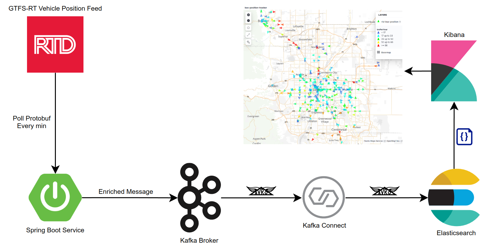

## Real-time Vehicle Tracker
A simple real-time bus location tracking application using the RTD-Denver GTFS-RT data feed. In this app, the Spring-Boot service continuously polls the protobuf telemetry feed from RTD in two mins intervals. Then it writes the enriched entities to a Kafka topic in Avro format and uses kafka-connect to ingest the messages to a pre-configured Elasticsearch index. Finally, I have used Kibana to create a dashboard to monitor the vehicle activities. I structured the pipeline with extensibility in mind so that data from similar sources and formats can be easily integrated.   

#### Architecture Diagram
<div>
  
</div>

.

**Requirements**: Java 17 or higher, docker and docker-compose.

**To run the pipeline,**

0. Requests for the data feed from certain regions are blocked by the RTD's CDN service. So, before running [check](https://www.rtd-denver.com/open-records/open-spatial-information/real-time-feeds) if it allows you make requests. Use vpn if it doesn't.
1. Clone the this repo and build the application
   ```sh
   git clone https://github.com/shakik19/realtime-vehicle-tracker.git
   mvn install
   ```
2. Run the docker-compose file, which will start all the necessary services and then the spring-boot app
   ```sh
   docker-compose up --build
   ```
3. Once everything is up and running, set the dynamic mapping template for the Elasticsearch index by sending the following http request,
   ```sh
   curl -X PUT -H "Content-Type: application/json" --data '{
     "mappings": {
       "dynamic_templates": [
         {
           "dates": {
             "match": "*timestamp",
             "mapping": {
               "type": "date",
               "format": "epoch_millis"
             }
           }
         },
         {
           "locations": {
             "match": "*location",
             "mapping": {
               "type": "geo_point"
             }
           }
         }
       ]
     }
   }' http://localhost:9200/spring.boot.vehicle.position.kafka.topic.v1
   ``` 
4. Now the final part. Check if the ElasticsearchSinkConnector is properly installed,
   ```sh
   curl localhost:8083/connector-plugins
   ```
   when installed, send the following http request to configure the Kafka to Elasticsearch connector,
   ```sh
   curl -X PUT -H "Content-Type: application/json" --data '{
       "connection.url"                      : "http://elasticsearch:9200",
       "connector.class"                     : "io.confluent.connect.elasticsearch.ElasticsearchSinkConnector",
       "key.converter"                       : "org.apache.kafka.connect.storage.StringConverter",
       "key.converter.schema.registry.url"   : "http://schema-registry:8081",
       "value.converter"                     : "io.confluent.connect.avro.AvroConverter",
       "value.converter.schema.registry.url" : "http://schema-registry:8081",
       "key.ignore"                          : "false",
       "schema.ignore"                       : "false",
       "name"                                : "rtd-elastic",
       "topics"                              : "spring.boot.vehicle.position.kafka.topic.v1",
       "type.name"                           : "_doc",
       "behavior.on.null.values"             : "delete",
       "write.method"                        : "upsert"
   }' http://localhost:8083/connectors/rtd-elastic/config
   ```


#### The realtime Dashboard in Kibana
<div>
  
</div>

.

More planned improvements,
1. Add rest of the fields of the feed to the BusLocation class for more insights
2. Find out how to view a specific route map in Kibana
3. ?? Add the trip updates and alerts feed ??