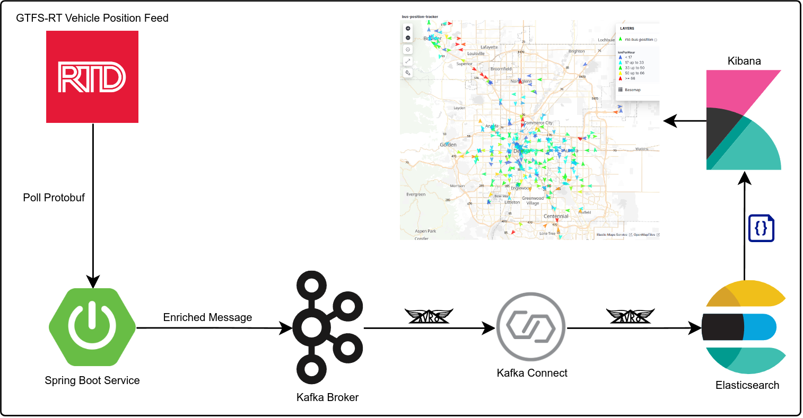
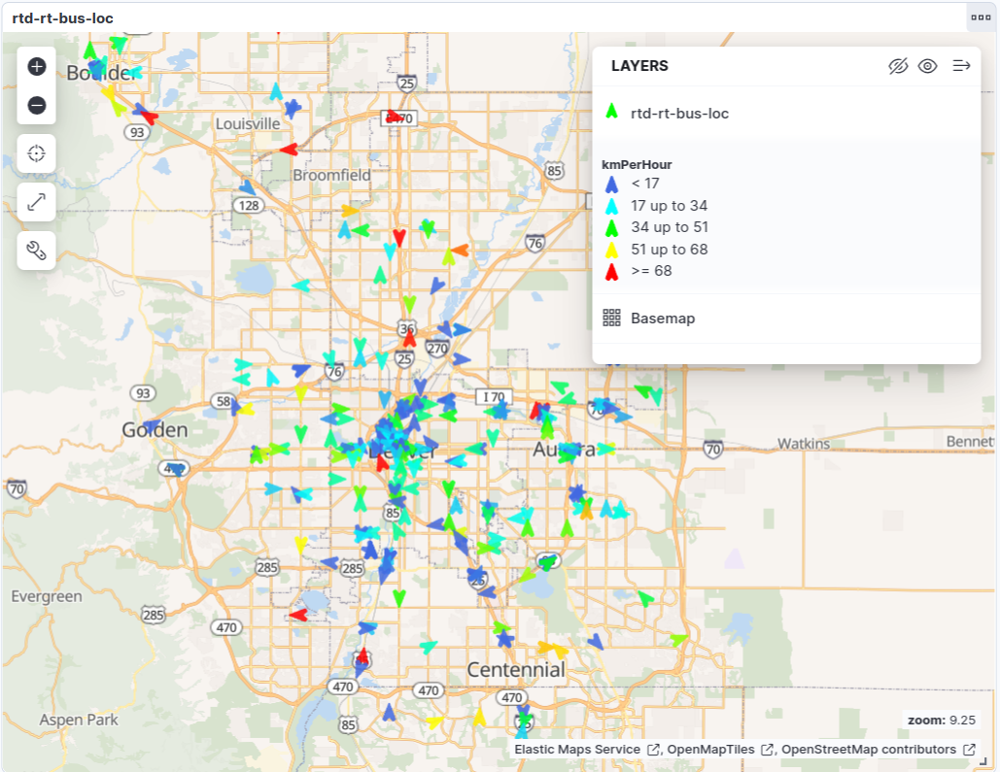

## Real-Time Vehicle Monitoring System — Intelligent Fleet Visualization & Insights

This project is a real-time monitoring platform built to oversee a fleet of buses, offering live insights into vehicle status, location, and movement across a mapped interface. Unlike basic tracking systems, this service is built with monitoring, analytics, and operational intelligence in mind.

The system ingests geospatial and telemetry data in real time, allowing transit operators to view fleet behavior holistically. While the current version focuses on live vehicle monitoring, the architecture is designed to support future enhancements including:

- **Speed Anomaly Detection** – Identify when vehicles exceed or fall below expected speeds in certain zones or timeframes.
- **Traffic Heatmaps** – Generate visual overlays to show congestion patterns, frequent stops, and route optimization opportunities.
- **Data-Driven Alerts & Reports** – Use historical trends for automated maintenance alerts or efficiency analysis.

Built with extensibility and data-driven decision-making in mind, this project lays the groundwork for intelligent fleet management tools that go beyond location tracking into predictive and prescriptive analytics.

#### Architecture Diagram
<div>
  
</div>

.

**Requirements**: Java 17 or higher, docker and docker-compose.

**To run the pipeline,**

0. Requests for the data feed from certain regions are blocked by the RTD's CDN service. So, before running [check](https://www.rtd-denver.com/open-records/open-spatial-information/real-time-feeds) if it allows you make requests. Use vpn if it doesn't.
1. Clone the this repo and build the application
   ```sh
   git clone https://github.com/shakik19/realtime-vehicle-tracker.git
   mvn install
   ```
2. Run the docker-compose file, which will start all the necessary services and then the spring-boot app
   ```sh
   docker-compose up --build
   ```
3. Once everything is up and running, set the dynamic mapping template for the Elasticsearch index by sending the following http request,
   ```sh
   curl -X PUT -H "Content-Type: application/json" --data '{
     "mappings": {
       "dynamic_templates": [
         {
           "dates": {
             "match": "*timestamp",
             "mapping": {
               "type": "date",
               "format": "epoch_millis"
             }
           }
         },
         {
           "locations": {
             "match": "*location",
             "mapping": {
               "type": "geo_point"
             }
           }
         }
       ]
     }
   }' http://localhost:9200/spring.boot.vehicle.position.kafka.topic.v1
   ``` 
4. Now the final part. Check if the ElasticsearchSinkConnector is properly installed,
   ```sh
   curl localhost:8083/connector-plugins
   ```
   when installed, send the following http request to configure the Kafka to Elasticsearch connector,
   ```sh
   curl -X PUT -H "Content-Type: application/json" --data '{
       "connection.url"                      : "http://elasticsearch:9200",
       "connector.class"                     : "io.confluent.connect.elasticsearch.ElasticsearchSinkConnector",
       "key.converter"                       : "org.apache.kafka.connect.storage.StringConverter",
       "key.converter.schema.registry.url"   : "http://schema-registry:8081",
       "value.converter"                     : "io.confluent.connect.avro.AvroConverter",
       "value.converter.schema.registry.url" : "http://schema-registry:8081",
       "key.ignore"                          : "false",
       "schema.ignore"                       : "false",
       "name"                                : "rtd-elastic",
       "topics"                              : "spring.boot.vehicle.position.kafka.topic.v1",
       "type.name"                           : "_doc",
       "behavior.on.null.values"             : "delete",
       "write.method"                        : "upsert"
   }' http://localhost:8083/connectors/rtd-elastic/config
   ```


#### The realtime Dashboard in Kibana
<div>
  
</div>

.

More planned improvements,
1. Add rest of the fields of the feed to the BusLocation class for more insights
2. Find out how to view a specific route map in Kibana
3. ?? Add the trip updates and alerts feed ??
